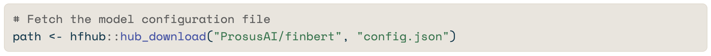
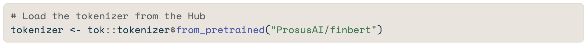
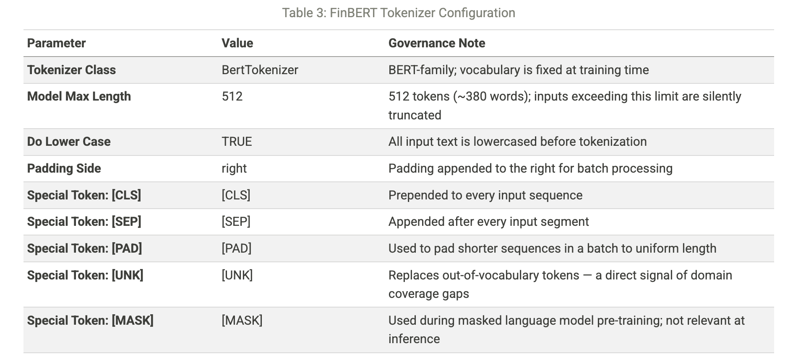
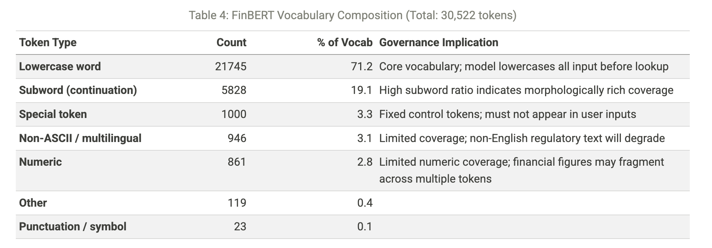
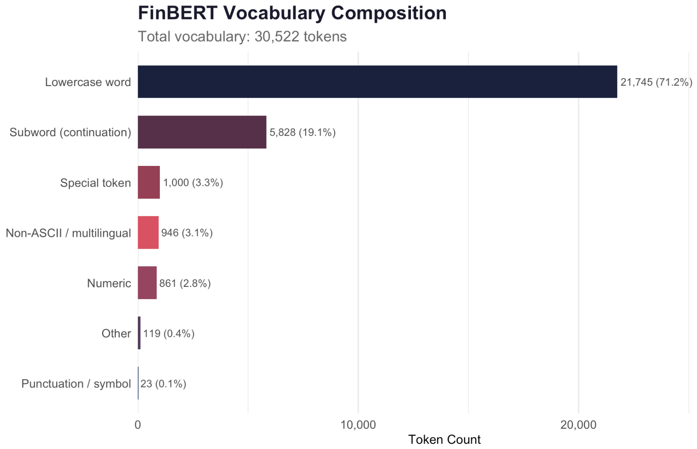
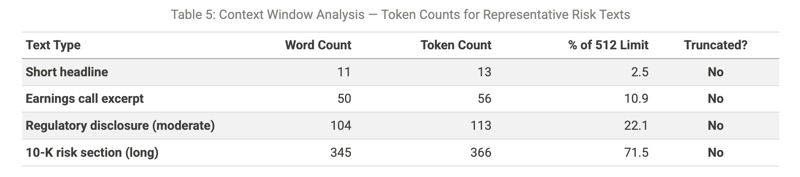
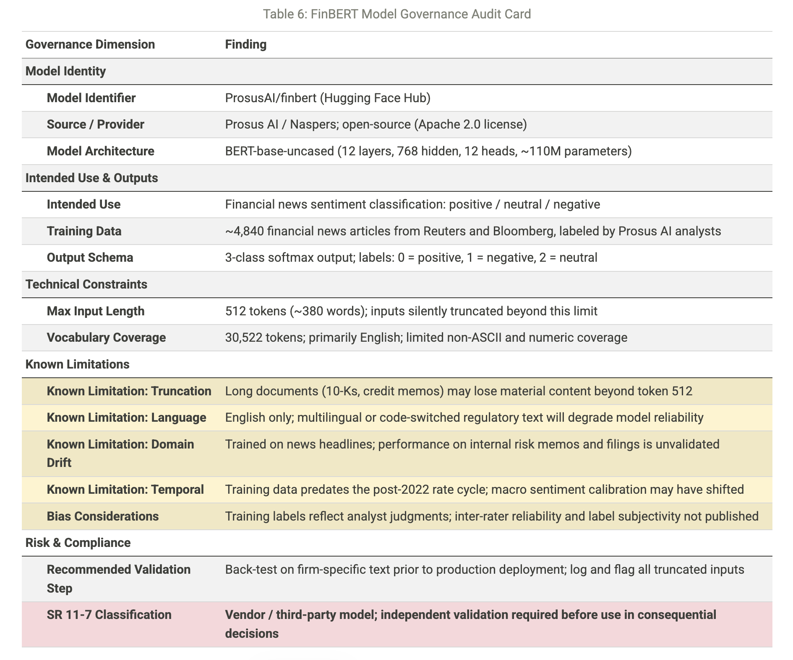

# Auditing a Pre-Trained Financial Risk Model With Huggy Face
*A Practical Introduction to Model Governance Using R packages hfhub & tok*

## Introduction

Every organization using a third-party AI model in risk or compliance faces a key question: what exactly did we approve? The model card is usually the main answer. It is the documentation published with open-source models on sites like Hugging Face. The card details training data, intended use, known limitations, and output schema. For organizations under SR 11-7, NYDFS model risk guidance, or the NIST AI Risk Management Framework, this documentation is essential. It serves as the baseline for independent validation.

The issue is that most risk practitioners view model cards as static web pages. They are reviewed manually and inconsistently. Two R packages, hfhub and tok, change this. They allow practitioners to pull model artifacts programmatically. They can also parse configuration files and create a structured audit record. This record can be reproduced, versioned, and embedded directly into governance documents.

This project illustrates the complete workflow using FinBERT (ProsusAI/finbert) as an example. FinBERT is a BERT-based sentiment classifier fine-tuned on financial news. It is one of the most cited open-source models in fintech AI and is used in firms for credit risk, market surveillance, and regulatory text analysis. Its wide use makes it a strong teaching case. The model is well-known, its limits are clear, and the governance issues it raises relate to any BERT-family model a risk team might face.

This project focuses on a metadata audit. It looks at:

- Architecture parameters

- Tokenizer configuration

- Vocabulary composition

- Context window constraints

No inference is performed, no GPU is needed, and the Python ecosystem is not required. The entire workflow runs in R.

::: {.callout-note icon=false}
## Understanding Hugging Face — And How It Differs from Gemini or Claude
This is an example of a callout where the icon is removed.
Hugging Face is an open-source model repository and machine learning platform. It is not just one AI system; it provides distribution infrastructure. Gemini (Google) and Claude (Anthropic) are different. You can only access them through their vendor APIs. Hugging Face has thousands of models. They come from universities, companies, and independent researchers. These models are available for direct download, inspection, and often modification.

This difference matters for governance. With a commercial API, the model is a black box: inputs go in, and outputs come out, but you can’t see the architecture, training data, or configuration. You can find the configuration files, tokenizer, and often the full model weights for a Hugging Face model available to the public. This transparency allows for structured metadata audits, making tools like hfhub and tok possible as R packages.

The practical differences also affect deployment. Gemini and Claude provide inference-as-a-service. The model operates on the vendor's infrastructure. Users pay for each token used. In contrast, organizations can download and run Hugging Face models on their own infrastructure. They can also evaluate these models without running them, as this project shows. This distinction impacts costs, latency, and data residency for financial institutions. It also shifts compliance responsibilities. When a firm uses the Claude API, it follows Anthropic's acceptable use policy. When a firm uses FinBERT internally, it takes on all model risk management responsibility under SR 11-7. There is no vendor support. The governance requirements differ significantly.

For risk practitioners, Hugging Face is valuable in three main ways. First, it serves as an audit target, helping document a model already in use within the organization. Second, it acts as a benchmarking resource. You can find domain-specific models for credit risk, regulatory text classification, and financial entity recognition on the Hub. These can be evaluated against internal data before any procurement or build decisions. Third, it provides research signals. Model cards, citation counts, and community talks on Hugging Face show popular modeling methods in finance. This often happens 12 to 18 months before those approaches appear in vendor product announcements. A risk team that monitors the Hub regularly is better equipped to anticipate governance questions that may arise.
:::

## Background: The R Packages

### hfhub — Fetching from Hugging Face Hub

The hfhub package exposes a single core function: hub_download(). Given a repository identifier and a file path, it retrieves the specified artifact from Hugging Face Hub and stores it in a local cache. The caching layout mirrors the Python huggingface_hub library, which means cached files can be shared across R and Python environments — a practical consideration for teams operating mixed-language pipelines.

The function returns the local file path, which can then be passed to any standard R parsing tool. In this project, that means jsonlite::fromJSON() for the JSON configuration files and base::readLines() for the plain-text vocabulary.

### tok — Tokenization in R

The tok package provides R bindings for the Hugging Face tokenizers Rust library. Its primary function is to convert raw text into the integer token sequences that transformer models consume. For governance purposes, the more relevant capability is inspection: tok exposes the tokenizer configuration directly, allowing a practitioner to verify vocabulary size, maximum sequence length, special token definitions, and case normalization behavior — all parameters that govern what the model can and cannot process.

Neither package requires model inference. Both operate entirely on the metadata and configuration layer — which is precisely the layer that governance review demands.

## Downloading Model Artifacts

Three files are retrieved from the FinBERT repository. The config.json file defines model architecture and output labels. The tokenizer_config.json file specifies how input text is processed before it reaches the model. The vocab.txt file contains the complete 30,522-token vocabulary — sampled and analyzed below, not printed in full.

::: {.callout-note icon=false}
## Caching and Reproducibility
hub_download() caches files on first retrieval. Subsequent calls return the cached path with no network request. For production governance workflows, artifacts should be pinned to a specific commit hash — not pulled from main — to ensure that audit records remain reproducible when the model card is updated.
:::

## Architecture Parameters
The configuration file records the structural parameters of the underlying BERT-base architecture. These parameters define the model’s representational capacity and, for governance purposes, its resource footprint in any deployment context.

### Classification Labels
FinBERT produces a three-class sentiment output. The label schema below is what the model returns — understanding it is a prerequisite for any downstream risk workflow that consumes model outputs.

## Tokenizer Audit
### Configuration Parameters
The tokenizer configuration specifies how raw text is transformed before it enters the model. Each parameter below has a direct governance implication: it constrains what the model can process reliably and how failures manifest when inputs fall outside the expected distribution.

### Vocabulary Composition
The `vocab.txt file` contains all 30,522 tokens the model recognizes. Any token absent from this vocabulary is silently mapped to `[UNK]` (unknown). For financial text — where regulatory acronyms, numeric sequences, and specialized terminology are common — the rate of out-of-vocabulary mappings is a direct indicator of model reliability in a given deployment context.

In the figure above, subword continuation tokens constitute the largest share, reflecting WordPiece segmentation of morphologically complex terms. Numeric coverage is limited — a governance consideration for financial figures.

## Context Window Stress Test
The `model_max_length: 512` parameter is a key limit for financial text applications. It sets a strict cap: any input over 512 tokens gets cut off. No error message is shown. The model just processes the first 512 tokens and ignores the rest.

This limit often affects financial documents, like regulatory disclosures and credit memoranda. If a disclosure starts neutral but ends with a serious event flag, it could be wrongly labeled as neutral. This happens if the negative content gets cut off after token 512.

The token counts below use a WordPiece method based on the `vocab.txt` file downloaded earlier. FinBERT provides only the old `BertTokenizer` format. This means it doesn’t have a fast-tokenizer interface in R. For estimates, a 1.35 token-per-word multiplier is used for out-of-vocabulary terms. This aligns with benchmarks for financial English on BERT-base. It also adds two tokens for the required `[CLS]` and `[SEP]` control tokens.

::: {.callout-note icon = false}
## Truncation is silent; and material
BERT-family models cut off inputs that exceed 512 tokens without notice. In a risk workflow, this means the end of a long credit memo or regulatory disclosure is lost. Risk teams using any BERT-family model should track token counts for each input. Send truncated documents for manual review. Don't let partial classifications move forward.
:::

## Model Governance Audit Card
The table below synthesizes the metadata review into a structured format aligned with SR 11-7 model documentation expectations. It is designed to serve as a transferable template: any BERT-family model can be audited using the same dimensions, with the findings column updated to reflect the specific model under review.

## Insights & Conclusion
The audit shows four important findings to address before using FinBERT or any BERT model in financial risk workflows.

First, the truncation issue is urgent. At 512 tokens, the model processes about 380 words. Most financial documents, like earnings calls and 10-K risk sections, exceed this limit. Truncation is silent, so a classifier using truncated input gives a confidence score that looks the same as one from complete input. Risk teams won’t know if the classification is partial unless token counts are clearly logged. Any deployment must address this.

Second, the training data for FinBERT is narrower than it seems. The model was trained on around 4,840 articles from Reuters and Bloomberg, labeled by Prosus AI analysts. This data is mostly focused on headlines and news. Using the model for internal credit narratives or regulatory findings introduces domain drift, which hasn’t been formally assessed. We don’t know how well the model performs with these text types.

Third, there is a vocabulary coverage gap for numeric tokens. Financial texts are full of figures—percentages, basis points, loan-to-value ratios. The BERT-base vocabulary has few pure-numeric tokens, so many multi-digit figures split into multiple sub-word tokens. This fragmentation doesn’t cause inference issues, but it means the model interprets “CET1 ratio of 13.4%” differently than a human would. This difference isn’t shown in the output scores.

Finally, SR 11-7 classification is clear: any model influencing a significant financial decision requires formal risk management.

This needs:

- Documentation of intended use

- Independent validation with firm data

- Ongoing performance monitoring

The model card is just a starting point for this documentation, not a replacement.

The project shows that the metadata layer of an open-source model can be fully audited from R in under 50 lines of code. The hfhub and tok packages make governance easier. What used to require Python skills and manual web checks is now a simple, repeatable R workflow. For organizations creating AI governance programs, this reproducibility is crucial. An audit that can be re-run against an updated model card is much more defensible than one that can’t.

